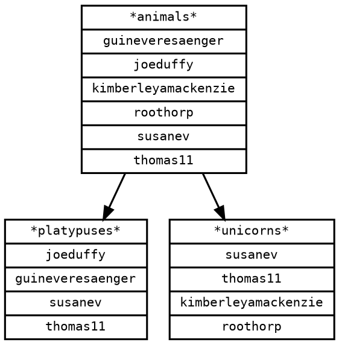

# teams

[](https://github.com/chuhlomin/teams/actions/workflows/main.yml)
[](https://github.com/chuhlomin/teams/actions/workflows/release.yml)
[](https://hub.docker.com/repository/docker/chuhlomin/teams)

A small Go application to visualize GitHub teams and their members.
Helps to find out:

- who is in which team
- who is not in any team
- teams parent-child relations
- teams that are logically a child of another team

## Example

For a fake GitHub organization [`shiny-platpus`](https://github.com/shiny-platypus/demo-universe/blob/main/teams.yaml) output would look like this:




## Running

### Binary

Download binary from [latest release](https://github.com/chuhlomin/teams/releases/latest).

```bash
$ teams --help
Usage:
  app [OPTIONS]

Application Options:
      --token=    GitHub access token [$GITHUB_TOKEN]
      --org=      GitHub organization name [$GITHUB_ORG]
      --template= Go template (optional) [$TEMPLATE]
      --output=   Output file (default: output/graph.dot) [$OUTPUT]

Help Options:
  -h, --help      Show this help message
```

```bash
$ teams --token ghp_... --org shiny-platypus --output output/graph.dot
```

### Docker Compose

See [docker-compose.yml](docker-compose.yml) for example of running the application with Docker Compose.

Set `GITHUB_TOKEN` and `GITHUB_ORG` environment variables.

Run the application:

```bash
$ docker-compose up
 ⠿ Container teams     Created
 ⠿ Container graphviz  Created
Attaching to graphviz, teams
teams     | 2022/12/28 12:00:00 Getting organization ID...
teams     | 2022/12/28 12:00:00 Getting organization members...
teams     | 2022/12/28 12:00:00 Getting organization teams...
teams     | 2022/12/28 12:00:05 Rendering template...
teams     | 2022/12/28 12:00:05 Done!
teams exited with code 0
graphviz exited with code 0
```

Open `output/graph.png` or `output/graph.svg`.

## Local development

Pre-requisites: [Go >=1.19](https://go.dev/dl/), [Graphviz](http://graphviz.org/download/).

Create GitHub [Personal Access Token](https://github.com/settings/tokens/new) with `read:org` scope.

Clone repository and run:

```bash
export GITHUB_TOKEN=your_token
export GITHUB_ORG=your_org
make clean run
```

Example output:

```bash
2022/12/28 12:00:00 Getting organization ID...
2022/12/28 12:00:00 Getting organization members...
2022/12/28 12:00:00 Getting organization teams...
2022/12/28 12:00:05 Rendering template...
2022/12/28 12:00:05 Done!
```

Open `output/graph.png` or `output/graph.svg`.

## Common problems

```bash
export GITHUB_TOKEN=<value>
export GITHUB_ORG=<value>
make clean run
2023/02/08 14:56:28 Getting organization ID...
2023/02/08 14:56:28 Getting organization members...
2023/02/08 14:56:28 Getting organization teams...
2023/02/08 14:56:36 Rendering template...
2023/02/08 14:56:36 Done!
make: dot: No such file or directory
make: *** [run-graphviz] Error 1
```

**Solution:** Install [Go >=1.19](https://go.dev/dl/) and [Graphviz](http://graphviz.org/download/)
