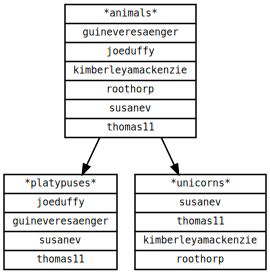
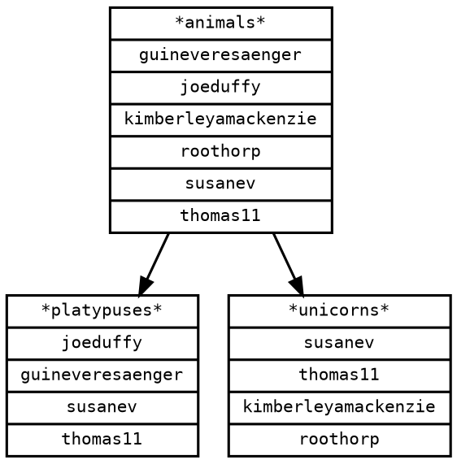

# people

A small Go application to visualize GitHub teams and their members.
Helps to find out:

- who is in which team
- who is not in any team
- teams parent-child relations
- teams that are logically a child of another team

## Example

For a fake GitHub organization [`shiny-platpus`](https://github.com/shiny-platypus/demo-universe/blob/main/teams.yaml) output would look like this:





## Usage

Pre-requisites: [Go >=1.19](https://go.dev/dl/), [Graphviz](http://graphviz.org/download/).

Create GitHub [Personal Access Token](https://github.com/settings/tokens/new) with `read:org` scope.

Clone repository and run:

```bash
export GITHUB_TOKEN=your_token
export GITHUB_ORG=your_org
make run
```

Example output:

```bash
2022/12/28 12:00:00 Getting organization ID...
2022/12/28 12:00:00 Getting organization members...
2022/12/28 12:00:00 Getting organization teams...
2022/12/28 12:00:05 Rendering template...
2022/12/28 12:00:05 Done!
```

Open `output/graph.png` or `output/graph.svg`.
